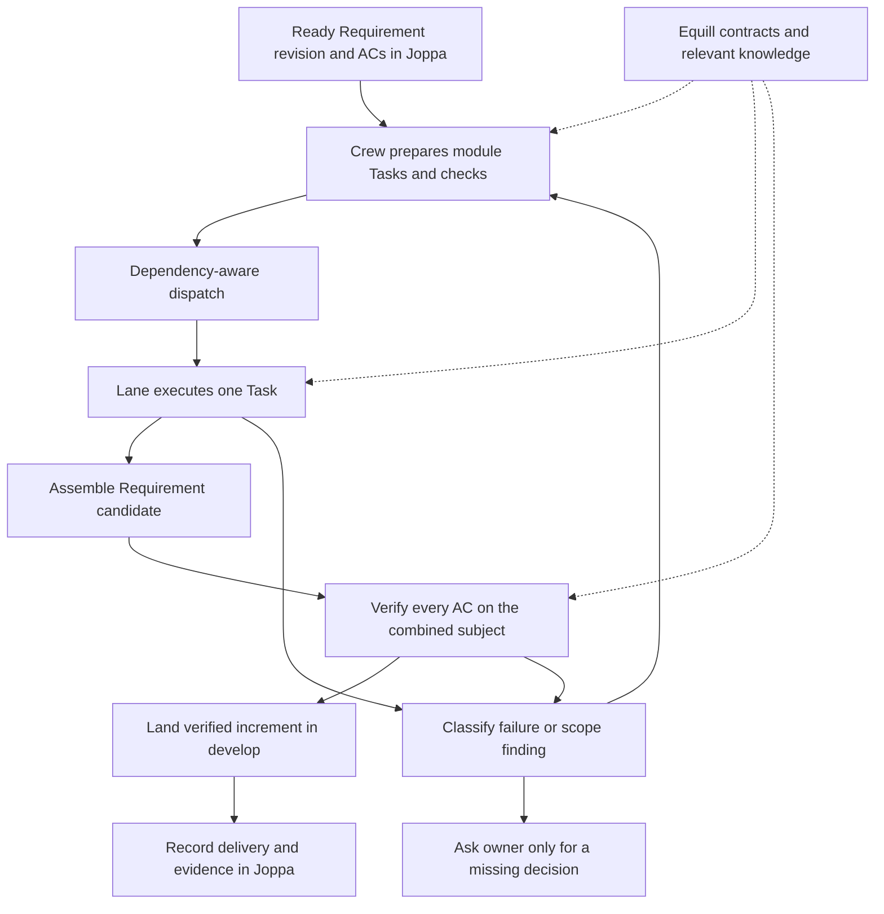
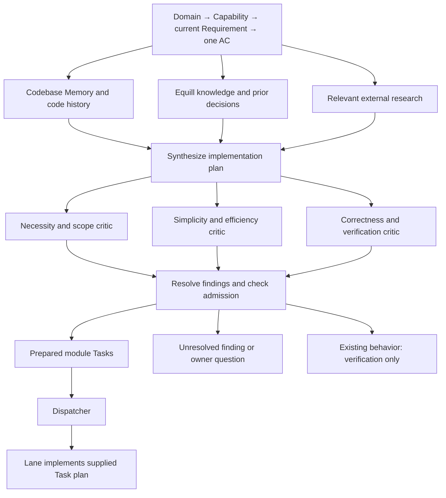

# Crew: delivering small, verified requirement increments

Research date: 2026-09-27. Repository baseline inspected: `7c0f563`.

This document records the owner's direction, findings from the current Joppa
model and Crew implementation, and external research. Recommendations below are
proposals until implemented and verified. This file does not change Joppa
requirements, Equill records, or runtime behavior.

## 1. Objective and agreed boundaries

The owner prepares product requirements in Joppa. Crew should turn ready work
into implemented, verified increments without requiring the owner to repeatedly
chase agents, interpret their logs, or restart failed attempts by hand.

The immediate delivery destination is **`develop` after the required checks and
review have passed**. Deployment to staging or production is deferred. Passing
local checks must not be presented as evidence of a deployed result. Required
integration or end-to-end checks still need an appropriate runnable environment;
an unavailable required check does not become a pass.

Agreed units:

| Unit | Meaning |
| --- | --- |
| Requirement revision | The agreed product commitment and its current ACs. |
| Increment | The implemented and verified result of one Requirement revision. |
| AC | One condition that must hold for that requirement to be acceptable. |
| Task | One minimal, coherent implementation change, owned by one AC and confined to one module of writes, including its necessary tests. |
| Lane attempt | One bounded attempt to execute one Task and return evidence or a concrete failure. |

An increment can contain several tasks and commits, and can involve several
repositories. Calling it one increment does not imply a distributed atomic Git
transaction. Its identity must include the relevant immutable component versions.

Earlier ideas that were corrected during this discussion:

- An individual AC is not our chosen delivery increment; the Requirement is.
- Crew includes technical decomposition and coordination, beyond lane execution.
- Two-hour implementation sessions are an observed current timeout, not an
  agreed target for task size.
- Staging and production deployment are outside the first delivery milestone.

## 2. Responsibilities: Joppa, Crew, Equill

| System | Responsibility |
| --- | --- |
| Joppa | Product meaning, REQ/AC revisions, decisions, readiness, Tasks, and verification evidence. It derives verification state from that evidence. |
| Crew | Read a ready Requirement in context, decompose its work, coordinate execution and recovery, assemble an increment, and return its verified outcome. |
| Lane inside Crew | Execute one small Task inside its declared module. Report the result; return scope discoveries to the coordinator. |
| Equill | Supply roles, processes, shared rules, relevant decisions, module knowledge, and confirmed lessons. |

Storing Tasks in Joppa does not make Joppa responsible for choosing their
technical decomposition. Crew agents can perform that work and record it there.
Business scope and policy remain decisions of the authorized owner; technical
decomposition must preserve them.

PM, GM, and QA describe responsibilities. They do not automatically require
separate permanently running agents. Queue selection, claim, limits, state
transitions, and routine retries should use deterministic code where possible.

### Findings from the current Joppa MCP

Inspected `joppa_model_docs` sections `model`, `process`, and `green`,
`joppa_help`, and current Crew requirement cards.

1. Each new implementation Task belongs to exactly one AC and has a nonempty
   technical contract and associated projects. One AC can have several Tasks.
2. Atomic claim/release exists for Tasks. The published command API inspected
   here does not provide a separate claim for planning an AC or Requirement.
3. The inspected Task command has no dedicated module or Task-dependency fields.
   A prose contract can describe them, but does not provide executable scheduling
   or boundary enforcement by itself. AC dependencies are a separate concept.
4. Completing Tasks and receiving a CLEAR code review do not verify an AC.
   Verification requires a sealed check plan and results on an immutable subject.
5. A full verification run belongs to a REQ revision and a subject composed of
   component versions. All ACs must pass on one subject for the revision to be
   ready for owner acceptance. Owner acceptance remains a separate action.

Joppa already describes Crew capabilities for preparing implementation tasks and
verifying delivered behavior. The inspected requirements, including “Only
complete implementation tasks enter the ready queue” and “Product QA verifies
ACs on an immutable subject,” were unconfirmed and had no verification runs.
Their existence is specification evidence, not proof of implemented automation.

Joppa also requires an owner-defined verification scope before the first plan
for a new revision. Automation should reuse applicable recorded decisions and
obtain missing decisions explicitly. It must not impersonate owner acceptance
or silently change the meaning of an AC.

## 3. What a minimal Task means

The proposed admission contract for a lane is:

1. **One concrete result:** a focused change whose success can be demonstrated.
2. **One module of writes:** resolve the module to its actual ownership boundary
   and allowed paths, including relevant tests and fixtures.
3. **Necessary tests included:** implementation and the tests needed to prove it
   belong together; passing existing tests alone may not establish the change.
4. **Explicit dependencies:** required interfaces and prerequisite work are
   available before execution, or the Task waits with a concrete reason.
5. **A stopping condition:** stop when the result is established; further
   improvements require their own justified scope.

Reading across modules is often necessary to understand callers and contracts.
Write boundaries must not turn into blind spots in analysis.

If another module must change, the lane returns the finding. Crew prepares a
separate Task for that module and updates the execution order. Triage and task
creation stay outside the lane.

Smallness is conceptual: one coherent change, limited uncertainty, and a clear
verification path. A fixed line count or file count cannot establish it. Fitting
in one context window is a useful upper bound, but is too permissive on its own.
No universal minute limit was established by this research. Initial budgets need
measurement on representative Crew Tasks rather than invented estimates.

For changes spanning module boundaries, agree the shared interface before
parallel implementation. Preserve compatibility in intermediate states. For
example, add a compatible API capability, update its consumer, and remove an old
interface only when the agreed scope requires it and consumers have migrated.
Avoid speculative interface work that has no required consumer.

Existing implementation can satisfy more than one AC. Reuse it; the one-AC Task
ownership rule does not require duplicating code. Each AC still needs its own
appropriate verification evidence.

### Supporting research

Spotify recommends one change per prompt and a verifiable end state. Its earlier
rigid loop struggled with multi-file changes and either insufficient or excessive
context, so it moved toward task-oriented execution with constrained tools.
[Spotify: Honk, Part 2](https://engineering.atspotify.com/2025/11/context-engineering-background-coding-agents-part-2).

Google's small-change guidance defines a change around one thing and includes
related tests. It warns against changes so fragmented that their implications
are hard to understand. This is general engineering guidance, not an AI-specific
experiment. [Google: Small CLs](https://google.github.io/eng-practices/review/developer/small-cls.html).

The snarktank Ralph implementation selects a single story per iteration, keeps
cross-iteration progress outside model context, and recommends stories small
enough for one iteration. This is a published implementation pattern, not a
universal reliability guarantee. [Ralph](https://github.com/snarktank/ralph).

## 4. Review simplicity as an explicit quality criterion

The owner's central review question:

> Could this meet the same acceptance criteria more simply and efficiently,
> with fewer concepts, dependencies, and failure points? Are we reusing what
> the project already provides? Is the result understandable, stable, and easy
> to change for the needs we actually know about?

Proposed English wording for the existing Equill QA process:

> Review the change for unnecessary complexity as well as correctness. For
> each substantial addition, identify the acceptance condition or compatibility
> need that requires it. Consider whether an existing project mechanism or a
> simpler design would meet the same requirements with fewer moving parts.
> Evaluate reliability, efficiency, and maintainability together. Assess
> extensibility against known needs. Do not invent future requirements.
> Recommend a redesign only when you can name a concrete alternative and
> explain its benefits and trade-offs. It is valid to find that the current
> design is already the simplest sufficient solution.

A useful finding contains:

1. The exact complexity and its location.
2. A concrete simpler alternative.
3. The demonstrated benefit: fewer states, dependencies, failure modes,
   duplicated paths, or relevant runtime costs.
4. Evidence that the alternative preserves ACs, compatibility, and required
   behavior under failure.
5. Trade-offs and the condition that would resolve the finding.

“More elegant” alone is not a blocking argument. Neither is an unsupported
performance claim. A short implementation that becomes fragile is not an
improvement. A new abstraction justified only by hypothetical future needs is
not established as necessary.

Preserve the current QA distinction: concrete blockers cause REJECT;
nonblocking suggestions can accompany CLEAR. Reviews should not force the
author to implement every stylistic preference or reopen unrelated code.

Spotify added a judge that compares the original prompt with the diff after
deterministic checks, because agents performed unrelated refactoring and disabled
flaky tests. It reported useful corrections but also said formal judge evals were
still missing. [Spotify: Honk, Part 3](https://engineering.atspotify.com/2025/12/feedback-loops-background-coding-agents-part-3).

Anthropic found value in a separate evaluator and agreement on testable outcomes
before implementation. It also observed increasing implementation complexity
over review iterations, with intermediate designs sometimes preferable to the
last one. Its application-generation experiments intentionally expanded scope;
that scope-expansion policy is incompatible with Crew's fixed requirements.
[Anthropic: Harness design for long-running applications](https://www.anthropic.com/engineering/harness-design-long-running-apps).

## 5. Equill as the required knowledge foundation

Prepare a compact context package before each role starts:

| Context | Delivery rule |
| --- | --- |
| Shared rules | Include applicable common records, including rules without a role. |
| Role and process | Load the required contract and stopping conditions. |
| Assignment | Include the REQ revision, AC, Task contract, module, and current code subject. |
| Module knowledge | Supply relevant interfaces, decisions, established examples, and available verification commands. |
| Lessons | Retrieve confirmed experience applicable to the current operation and environment. |

Required context must be delivered reliably across supported harnesses. Merely
configuring a hook is not evidence that the agent received it. Save a receipt of
the delivered records and versions so a failed run can be diagnosed.

Missing mandatory role/process context prevents the stage from starting. An
optional knowledge search with no matching records is a valid result; Crew
should identify whether any missing fact is actually necessary for the task.

During execution, select additional context based on the current action or
failure. Avoid repeatedly adding the same material. Keep stable requirements
visible through compaction or handoff, and distinguish current authoritative
decisions from historical observations and unverified hypotheses.

Equill records explain what is known and how to work. Execution state belongs in
Joppa and the workflow journal. Confirmed failure lessons can be curated into
Equill with their applicability and evidence; a failed agent's theory must not
automatically become a permanent rule.

Anthropic recommends a minimal set of relevant context, combining initial
guidance with information fetched when needed.
[Context engineering](https://www.anthropic.com/engineering/effective-context-engineering-for-ai-agents).

Spotify describes supplying service ownership, dependencies, and decisions at
session start. Its published comparison showed a better and faster result for
one task with that context. This is a useful illustration, not a statistical
forecast of Crew's speedup.
[Spotify: The hidden tax on AI agents](https://portal.spotify.com/blog/the-hidden-tax-on-your-ai-agents).

HumanLayer's research/plan/implement account includes both successes and an
unsuccessful dependency migration. It also required substantial human engagement.
The useful lesson for Crew is to preserve accurate research and concise handoffs,
while recognizing that incorrect early findings can misdirect many later edits.
[Advanced context engineering](https://www.humanlayer.dev/blog/advanced-context-engineering).

## 6. Proposed Requirement-to-increment workflow

This diagram expresses responsibilities; it does not approve unlimited loops.
Recovery is subject to a bounded policy and preserved evidence.

### Candidate assembly and landing

Proposal: use a short-lived increment candidate for each affected repository.
Tasks contribute reviewed changes to it. Verify the combined Requirement subject
before publishing that increment to `develop`.

This differs from the current lane, which lands each ticket directly. Adopting
Requirement-level landing will require separating Task completion from increment
publication. The exact branch and integration implementation is still undecided.

Changes to the tested candidate invalidate its checks. If the target advances,
form and verify the actual candidate that will land. Across repositories, record
each publication result and the complete subject; do not claim atomic publication
of several repositories without an implementation that provides it.

GitHub's merge queue demonstrates testing changes against the current base and
queued changes before merge. Crew can use that principle without committing to
that particular service or introducing another framework.
[GitHub: Managing a merge queue](https://docs.github.com/en/repositories/configuring-branches-and-merges-in-your-repository/configuring-pull-request-merges/managing-a-merge-queue).

### Verification

Provide known commands for the relevant repository/module so each agent does not
rediscover its build system. Keep full logs as artifacts and return concise,
actionable results to the model. Review whether tests establish the AC, rather
than merely mirror the implementation. Required checks cannot be removed or
weakened to manufacture a pass.

Task-level checks provide fast feedback. The complete Requirement check run
establishes the assembled increment's result. Both must identify the code and
configuration they actually checked. An LLM verdict complements executable
evidence; it does not replace missing tests.

## 7. Stalls and recovery

Distinguish at least these failure classes:

| Failure | Next action |
| --- | --- |
| Missing product decision | Ask the relevant owner; continue independent eligible work. |
| Task crosses a module or has a hidden dependency | Return the finding to Crew's planner and revise the technical breakdown. |
| Implementation defect | Return the failing check and evidence for a bounded correction. |
| Environment or transient infrastructure failure | Restore the environment or retry the affected operation under policy. |
| Operation may have succeeded but its acknowledgment was lost | Reconcile actual state before retrying the side effect. |

Repeated edits and identical failures without new evidence are stall signals.
They should trigger reconsideration or a bounded handoff. Edit counts alone are
not proof of a stall: valid work can revisit the same file many times.

LangChain used trace analysis, completion-time verification reminders, time
budget notices, and repeated-edit detection to improve a benchmark harness.
Its loop detector nudges the model; it is not a guarantee of stopping. Crew
needs its own measured limits and deterministic terminal behavior.
[LangChain: Improving Deep Agents with harness engineering](https://www.langchain.com/blog/improving-deep-agents-with-harness-engineering).

Save the Requirement revision, Task outcomes, candidate commits, check receipts,
and next unfinished step. A restart should reuse completed work where it remains
valid. Preserve stable operation IDs across uncertain retries, particularly for
Task creation, claims, reporting, and publication.

Temporal's durable-execution guidance explains why retries require idempotent
effects and why a missing response does not establish that an operation failed.
This is a reliability principle to apply to the current engine, not a decision
to adopt Temporal.
[Idempotency and durable execution](https://temporal.io/blog/idempotency-and-durable-execution).

## 8. Gaps in the implementation inspected

| Observation | Implication |
| --- | --- |
| [workflow.yaml](lane/workflow.yaml) has a 24-hour run timeout and a two-hour implementation-node timeout. Review rejection counting restarts after `git_fix`. | These are not a measured policy for minimal Tasks or a single total correction budget. |
| [run.sh](lane/run.sh) validates the ticket's module, while [gates.py](lane/bin/gates.py) records its name without enforcing changed-file ownership. | Built-in checks do not mechanically enforce the module boundary. Repository-supplied gates may add checks, but that must be verified per project. |
| Scout/QA contract loading can continue after failure; the coder's SessionStart hook treats a missing baseline as fatal. | Equill's mandatory status is inconsistent between stages and harnesses. |
| The current dispatcher and lane use NTK HTTP and ticket-level landing. | Joppa Requirement planning, Task scheduling, increment assembly, and final reporting are not implemented by that path. |
| Failure handling preserves useful artifacts, but the documented next operator action is manual; `to_test` ends the ticket path. | The complete Requirement delivery and recovery loop remains open. |

Existing code worth preserving: confirmed claim receipts, isolated persistent
worktrees, exact-candidate check receipts, reviewed-tree checks, bounded status
reporting retries, and non-force landing. AgentBus remains outside the lane.

Also inspect the handoff claim that reconnaissance ran on the exact worktree:
the graph performs reconnaissance before fetch/worktree creation. A claimed
identity of source snapshots needs recorded SHA evidence, not a prompt assertion.

## 9. Measure delivery, including the cost of extra work

Use a small representative set of known Tasks and Requirements when changing
roles, prompts, context delivery, or models. Include an earlier overengineering
case and an earlier failure-recovery case. Measure:

1. Verified increments delivered and their correctness.
2. Elapsed time to delivery, separated by preparation, execution, checks, and waiting.
3. Human interventions and repeated investigation.
4. Correction rounds, recurring failures, and scope violations.
5. Unnecessary complexity identified during review and regressions after delivery.

A faster refusal is not a delivered increment. More commits, larger diffs, or
more agent calls are not evidence of greater output.

Anthropic reports using evaluations for overengineering and distinguishes final
environment outcomes from what an agent says in its transcript.
[Demystifying evals for AI agents](https://www.anthropic.com/engineering/demystifying-evals-for-ai-agents).

OpenAI describes mechanically enforced architectural boundaries and curated
repository knowledge. Its report is an organizational case study, not proof that
the same outcomes follow from copying the tooling.
[Harness engineering](https://openai.com/index/harness-engineering/).

Cursor's experiments show failure modes of unrestricted peer coordination and
an executor overloaded with planning, coding, merging, and judging. Its eventual
separation of scoped planners and workers is relevant; its scale and tolerance
for intermediate errors are not automatically suitable for Crew.
[Towards self-driving codebases](https://cursor.com/blog/self-driving-codebases).

## 10. Joppa inventory audit and specification refresh

### Before the refresh

Re-read the Crew index and relevant current requirement revisions at journal
position 215. The workspace contains 16 Requirements, all unconfirmed and all
without a current verification run. The Task queue returned `total: 0`.
Local implementation notes exist on some cards; those notes do not constitute
completed Joppa verification.

| Area | Assessment |
| --- | --- |
| Claim, candidate checks, landing, and recovery | Useful existing requirements. Preserve their same-tree evidence, non-force publication, and no-repeat-after-landing guarantees. |
| Preparing implementation Tasks | The current card describes admission of complete Tasks. It does not yet specify complete REQ-to-AC-to-module decomposition or assembled Requirement delivery. |
| Review | The current card prescribes three unanimous reviewers and rejection rounds. The explicit simplicity/efficiency criterion discussed here is absent. |
| Equill | The current card still lists `medulla-scout`, `medulla-coder`, `medulla-qa`, and `medulla-triage`. The repository uses `crew-lane-*` and excludes triage from lane execution. Reliable delivery of mandatory context needs a clearer observable requirement. |
| Joppa integration | Some cards describe `to_test`, `blocked`, a first-class Attempt, and Task-parent dependency enforcement as if they were current Joppa lifecycle features. The published API instead exposes Task claim/release/completion with derived `open`, `in_progress`, and `done`; these contracts need reconciliation. |

A historical integration comment says atomic queue claim is unavailable. Current
MCP help exposes `claim_next_task`, so that particular blocker is outdated. This
does not establish that first-class attempts or Task-level dependency scheduling
have also been implemented. Correct historical statements with linked updates;
preserve the original journal.

Some readiness questions also predate the current owner decisions: the initial
lane limit was already specified as one, and the first delivery destination is
now `develop` without deployment. Those decisions can resolve the corresponding
parts of the discussion; they do not answer every question about dependency
completion, backlog control, or the allowed publication repositories.

The inventory is a usable starting specification, but it mixes an earlier
ticket-level lane lifecycle with the newly clarified Requirement-level delivery
goal. Keeping the existing IDs and reconciling their meaning will preserve more
useful history than creating a competing tree.

### Changes saved on 2026-09-27

Updated 12 existing Requirements while preserving their identities and existing
AC identities. Added 15 ACs across preparation, review, context delivery,
dispatch, recovery, scope enforcement, and increment delivery. The remaining
four Requirements retain their wording. Research sources are linked to the
relevant cards; the obsolete claim blocker has a linked correction.

The resulting contracts describe this division of responsibility:

| Responsibility | Current specification |
| --- | --- |
| Preparation | Cover current Requirement ACs with minimal Tasks, one write module per Task, explicit prerequisites, and repeatable preparation without duplicate Tasks. |
| Lane | Execute one claimed Task, enforce its module boundary, obtain mandatory Equill context, and produce a tested and reviewed candidate. |
| Review | Check the frozen candidate for correctness and unnecessary complexity; require evidence for blocking findings and consider concrete simpler alternatives. |
| Coordination | Dispatch eligible Tasks within the lane limit, retain progress, reconcile uncertain effects, and bound repeated failures. |
| Delivery | Assemble the Requirement candidate, verify all its ACs against the exact subject, and publish the verified increment to authorized `develop` branches. |

Readback confirmed the 12 revised cards after the main update. A subsequent
Equill refinement requires delivery to each fresh, delegated, resumed, or
compacted agent context. A parent's receipt alone does not establish that its
child received the contract. The delivery capability title now matches its
Requirement-level responsibility.

These are specification changes. Wording remains unconfirmed, verification is
still outstanding, and no live execution was started. The publication AC still
has an explicit owner question about which repositories may receive automatic
publication to `develop`; the destination branch alone does not define that
allowlist. Roles and process implementations in Equill were not changed here.

## 11. Where dolber fits

[dolber.sh](lane-launcher/dolber.sh) is a small shell entry point into the Node.js
[launcher](lane-launcher/launcher.mjs). This is a suitable implementation for a
deterministic dispatcher; the shell wrapper does not need to become a workflow
engine.

The current dispatcher already provides the useful operational shell: configured
concurrency, polling, local slot reservations, Herdr tabs, persistent logs, and
reconciliation of active or uncertain runs. It previews an NTK candidate, reserves
a slot, and starts a worker; the lane claims the ticket before implementation.
Stopping the dispatcher does not itself terminate existing lanes.

The current queue integration is [NTK HTTP](lane-launcher/ntk.mjs). Its tags and
preferred tags are not Joppa queue selectors. Joppa adoption requires adapting
selection, claim, scope loading, and outcome reporting, with an unattended agent
identity. It is not a URL substitution. Project-to-repository configuration and
Crew's prerequisite checks must also agree with the selected Task.

Requirement decomposition and assembled-increment verification belong outside
this dispatch loop. A worker exit code establishes a process outcome; it does
not establish that a Requirement was delivered. Preserve the dispatcher and its
operational behavior while changing the queue boundary and connecting it to
Requirement coordination. The current NTK path remains the implementation until
those changes exist and are verified.

## 12. Letta: durable knowledge and explicit context delivery

Reviewed the current documentation linked by the owner on 2026-09-27. The
patterns below are relevant to Equill and Crew; choosing Letta as a runtime
would be a separate implementation decision.

### Small mandatory context, deeper knowledge on demand

Letta's MemFS projects Git-backed agent memory into files. Files under `system/`
enter the system prompt every turn; other files are retrieved when needed,
with their tree serving as an index. Memory edits have version history.
[Letta: MemFS](https://docs.letta.com/concepts/memfs).

**Crew application:** keep roles, shared rules, and the current assignment small
and mandatory. Retrieve relevant module knowledge and decisions separately.
Record the versions actually delivered. Adding the whole knowledge base to
every request would work against this separation. Retrieval deduplication must
be scoped to the receiving context, not globally to the whole run.

### Shared knowledge needs ownership and synchronization

Letta distinguishes agent-owned memory from organization-owned shared memory
repositories. Agents commit and push changes; other checkouts must synchronize.
The documented shared-repository feature requires cloud-hosted agents, and the
older shared-memory-block API is now described as legacy.
[Letta: Shared memory](https://docs.letta.com/concepts/shared-memory).

**Crew application:** keep shared roles, rules, and confirmed project knowledge
authoritative in Equill. Personal scratch notes must not silently redefine
shared policy. A context receipt must identify the version read rather than
merely say that memory was attached.

### Learning from completed runs needs a review boundary

Letta's dreaming mechanism consolidates conversation lessons in the background.
Its optional second-agent review does not request human approval. Its memory
doctor audits placement, duplication, and prompt size.
[Letta: Memory & dreaming](https://docs.letta.com/configuration/memory).

**Potential Equill improvement:** derive proposed lessons from observed failures
and successful corrections, retain supporting evidence and module scope, and
check for duplicates or obsolete advice. Distinguish a proposed lesson from an
approved policy or product decision. This is a research suggestion, not an
implemented learning loop or authorization for agents to rewrite shared rules.

### A child agent does not automatically inherit the right context

Letta's dynamic workflows use JavaScript orchestration. Their subagents receive
the prompt supplied by the script without the parent's memory, conversation,
or skills. Stage outputs pass through the script, and execution has explicit
concurrency and per-agent limits.
[Letta: Dynamic Workflows](https://docs.letta.com/configuration/workflows).

**Crew application:** explicitly supply and verify each stage's contract and
assignment; preserve or restore them across context compaction and resumption.
Keep deterministic scheduling and stop conditions in the orchestrator. These
findings support the existing dispatcher and context-delivery direction, but
the documentation does not demonstrate Crew's full Requirement-to-develop
delivery contract or establish that switching frameworks would improve it.

## 13. Planning workflow

The agreed workflow name is `planning`. Triage and decomposition are stages
within this separate workflow; its output is the implementation plan for lane.

On 2026-09-28 the owner requested a separate workflow that researches and
challenges an AC before declaring it ready for implementation. The workflow
must deliver both the intended change and a concrete implementation approach.
This is preparation outside lane. Its specification is recorded in Joppa.
The executable [planning workflow](planning/README.md) now implements the
research, design, independent-criticism, and local-admission path. It takes an
input selectors, hydrates the live Joppa hierarchy and writes a local result.
An admission check compares the live hierarchy and enforces a fixed 24-hour
lifetime before an explicitly linked lane launch. Automatic Task creation and
queue handoff remain integration work.
The required input includes Domain and Capability meaning and constraints,
not just their identifiers. Every planning participant receives the complete
Domain -> Capability -> Requirement -> selected AC context; parent context
does not expand the implementation scope beyond that AC.

### Evidence collection

Independent research branches run concurrently. Codebase Memory identifies
existing behavior, entry points, callers, module boundaries, reuse candidates,
and similar implementations. Follow the project's CBM runbook: scoped search
first, similarity inspection before proposing new code, conditional semantic
search and tracing, and verification against the actual worktree. The index is
not proof of Git history; inspect relevant commits and linked decisions for
why an implementation exists or an earlier approach failed.

Equill provides mandatory role/process contracts, shared rules, relevant
knowledge, and confirmed lessons to each participant. External research answers
a specific uncertainty and uses primary documentation applicable to the actual
library or platform versions. If it is unnecessary, record that applicability
decision instead of manufacturing a best-practices survey. Failure to retrieve
mandatory evidence cannot be treated as a successful empty search.

### Plan and independent criticism

The lane handoff must state the current Requirement revision and AC, outcome,
selected approach and rationale, reuse points, repository and write module,
concrete edit steps and interfaces, prerequisite Tasks, and executable checks
with expected results. Record relevant code and Equill versions so that changed
premises can invalidate the affected plan. Additional write modules require
separate Tasks.

Three proposed critic responsibilities cover distinct questions:

| Critic | Question |
| --- | --- |
| Necessity and scope | What requested outcome is missing? Is it already satisfied? Would doing nothing or a smaller change meet the agreed need? |
| Simplicity and efficiency | Can existing code or a smaller approach achieve the same outcome? What concrete trade-off justifies the selected design? |
| Correctness and verification | Do the interfaces, dependencies, failure cases, and checks make the plan executable and its outcome demonstrable? |

The owner explicitly rejected using one model for every participant. The current
workflow uses Claude Opus for plan design and three different critic families:
GPT through Codex, Gemini through AGY, and GLM through OpenCode, matching the
existing lane's reviewer pool. Research remains on Codex. Each critic keeps its
own session and verdict; there is no fallback that silently turns the panel into
multiple copies of one model. This diversifies reviewers without claiming that
model diversity itself proves the plan correct.

Critics receive the same plan and evidence, record their initial findings
independently, and then resolve substantive objections. Findings must cite
evidence; reviewer preference alone cannot force redesign. Critics can surface
a product contradiction but cannot silently revoke an owner's decision.

The workflow uses finite configured research and revision budgets. Exhaustion
returns unresolved findings without granting implementation readiness. Existing
behavior routes to verification without creating unnecessary implementation
Tasks. Independent ACs do not wait for an unrelated unresolved AC.

### Boundary with lane

Lane follows the supplied approach and remains responsible for correct local
implementation and tests. The plan specifies meaningful engineering choices;
it need not dictate every line of code. If the code contradicts a premise or
requires a different scope, module, or approach, lane stops with evidence for
preparation. Lane does not invoke this research-and-criticism workflow itself.

Spotify describes assembling context in advance, including through separate
workflow agents, while warning that both vague and excessively prescriptive
prompts fail. This supports a concrete implementation contract with explicit
preconditions and verifiable outcomes.
[Spotify: Context engineering](https://engineering.atspotify.com/2025/11/context-engineering-background-coding-agents-part-2).

Anthropic describes parallel independent sections, focused evaluators, and
programmatic gates between stages. These support the proposed composition;
they do not establish that more reviewers automatically improve delivery.
[Anthropic: Building effective agents](https://www.anthropic.com/engineering/building-effective-agents).

### Implementation review, 2026-09-28

Two AgentBus reviewers examined the local workflow: the lane/runtime maintainer
and Joppa PM. Confirmed fixes include per-branch parse-error receipts, bounded
memory for hashing large diffs and untracked files, and exact-path CBM coverage
receipts tied to the code report's inspected and cited files. Missing or changed
metadata blocks preparation. A clean coverage response remains best-effort;
it cannot establish complete discovery or equality with a different worktree.
Current source must still be inspected. Commit dates are not index-version proof.

Real Medulla tests refuted a proposed nested-signal injection: its strict parser
keeps nested tags inside the variable body, while planning rejects the exact
closing delimiter needed to escape it. Regression tests cover both cases.
Plan digests bind verdicts to the correct plan, including after retries; they
do not prove comprehension. One bounded pass preserves research and plan
artifacts when blocked; automatic revision loops are not implemented.

The result identifies itself as a local plan. After the review, the owner chose
a deterministic freshness policy: changes to the Domain/Capability/Requirement/AC
chain or age >=24 hours invalidate it; failed reads prohibit launch. The workflow
now reads and compares the current hierarchy at prepare, finish, and through
`admit.py` immediately before a linked lane launch. Read checks never renew age.
Tests cover the exact time boundary, each hierarchy level, inconsistent reads,
and expiry during lane setup. The unattended client requires an existing Joppa
service credential; editor OAuth is not reused or extracted.

Production queue handoff still needs source-linked decisions, idempotent Task
creation with project mappings and applicable technical contracts, and enforced
prerequisites before lane claim. Joppa does not execute the local plan's
`depends_on` field. These remain delivery gaps.
